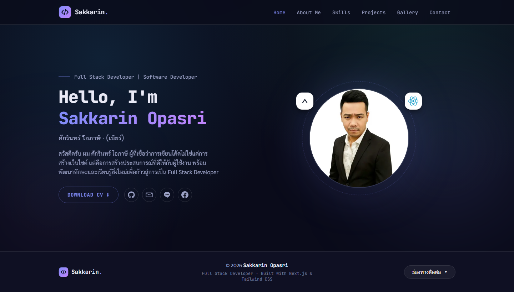
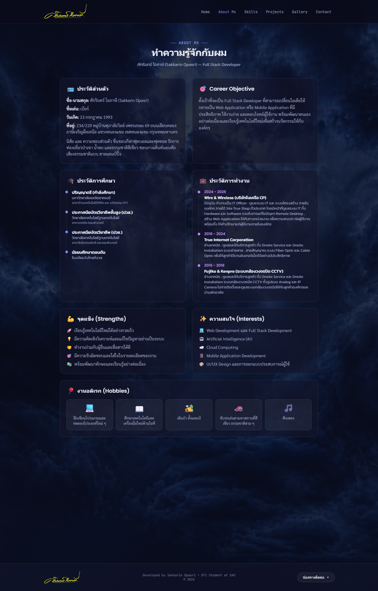
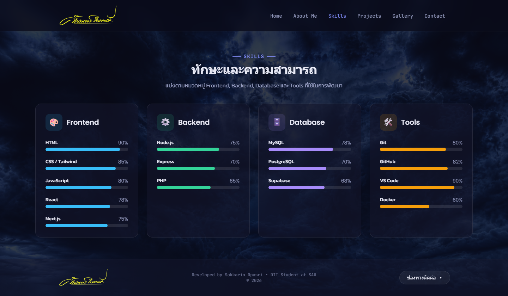
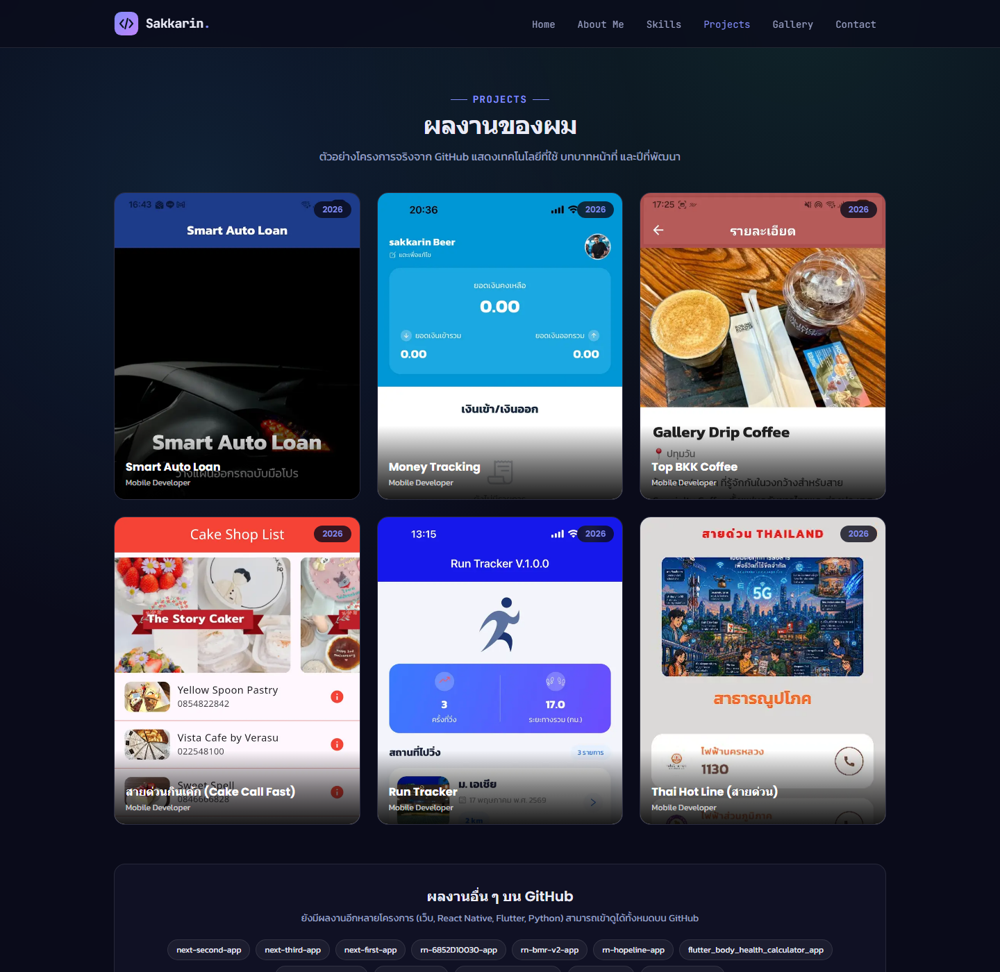
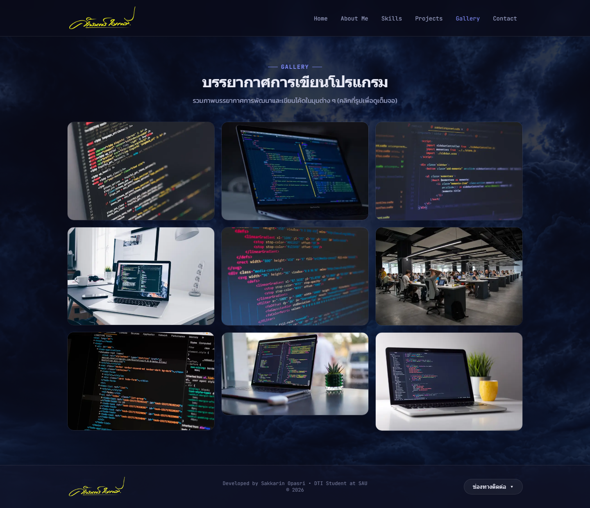
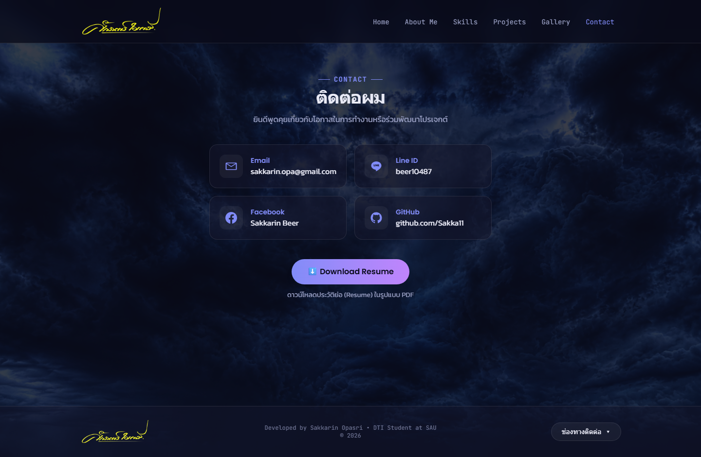

# next-sakkarin-portfolio-app

เว็บไซต์ **Portfolio ส่วนตัว** ของ **ศักรินทร์ โอภาษี (Sakkarin Opasri)**
สำหรับใช้ประกอบการสมัครงานในตำแหน่ง **Full Stack Developer**
พัฒนาด้วย **Next.js (App Router)**

> 🎓 โปรเจกต์นี้เป็นงาน Midterm รายวิชา Web Application Development

---

## 🔗 ลิงก์ส่งงาน

- **GitHub Repository:** https://github.com/Sakka11/next-sakkarin-portfolio-app
- **Vercel (Live Demo):** https://next-sakkarin-portfolio-app.vercel.app

---

## 🛠️ พัฒนาด้วยเครื่องมืออะไรบ้าง (Tech Stack)

| ประเภท | เครื่องมือ |
| --- | --- |
| Framework | **Next.js 16** (App Router) |
| Library | **React 19** |
| ภาษา | **TypeScript** |
| CSS | **Tailwind CSS v4** |
| Image Optimization | **next/image** (static import + remote `images.unsplash.com`) |
| Font Optimization | **next/font/google** (Kanit, Poppins, Sarabun, JetBrains Mono) |
| Editor | **Visual Studio Code** |
| Version Control | **Git + GitHub** |
| Deploy | **Vercel** |

---

## 📄 หน้าเว็บทั้งหมด (Pages & Routes)

| หน้า | Route | รายละเอียด |
| --- | --- | --- |
| Home | `/` | หน้าสรุป (เลื่อนได้): Hero → Skills → Projects → Gallery → Contact พร้อมปุ่ม See More |
| About Me | `/about` | ประวัติส่วนตัว การศึกษา การทำงาน Career Objective จุดแข็ง ความสนใจ งานอดิเรก |
| Skills | `/me/skills` | ทักษะแบ่งหมวด Frontend / Backend / Database / Tools (มี progress bar) |
| Projects | `/me/projects` | ผลงานจริงจาก GitHub พร้อมรูป เทคโนโลยี บทบาท ปีที่พัฒนา และลิงก์ไป repo |
| Gallery | `/me/gallery` | ภาพบรรยากาศการเขียนโปรแกรม 9 ภาพ (คลิกดูรูปเต็มจอได้) |
| Contact | `/contact` | Email, Line ID, Facebook, GitHub และปุ่ม Download Resume (CV จริง) |

---

## 🖼️ ภาพแต่ละหน้า (Screenshots)

### 🏠 Home — `/`
🔗 https://next-sakkarin-portfolio-app.vercel.app/


### 👤 About Me — `/about`
🔗 https://next-sakkarin-portfolio-app.vercel.app/about


### 🧠 Skills — `/me/skills`
🔗 https://next-sakkarin-portfolio-app.vercel.app/me/skills


### 💼 Projects — `/me/projects`
🔗 https://next-sakkarin-portfolio-app.vercel.app/me/projects


### 🖼️ Gallery — `/me/gallery`
🔗 https://next-sakkarin-portfolio-app.vercel.app/me/gallery


### ✉️ Contact — `/contact`
🔗 https://next-sakkarin-portfolio-app.vercel.app/contact


---

## ✨ ฟีเจอร์เด่น

- 🎨 **พื้นหลังภาพทั้งเว็บ** (ท้องฟ้าเมฆ) + ธีมโทน Indigo และฟอนต์ monospace สไตล์ Developer
- ✍️ **โลโก้ลายเซ็นจริง** ที่ navbar และ footer (กดกลับหน้าแรกได้)
- 📜 **หน้า Home แบบเลื่อนได้** มี Preview ของแต่ละส่วน + ปุ่ม **See More →** ไปหน้าเต็ม
- 🔍 **คลิกดูรูปเต็มจอ (Lightbox)** ในหน้า Projects และ Gallery
- 📱 **Responsive** รองรับมือถือ (เมนู Hamburger, การ์ดโชว์ข้อมูลครบบนมือถือ)
- 📄 **Resume (CV) จริง** เป็น PDF ในปุ่ม Download

---

## ✅ ข้อกำหนดด้านเทคนิค

- **Layout & Shared Components** — มี Component กลางที่นำกลับมาใช้ซ้ำหลายหน้า:
  `NavBar`, `Footer`, `SectionTitle`, `SkillCard`, `ProjectCard`, `Icons`, `Lightbox`, `GalleryGrid`
- **Image Optimization** — ใช้ `next/image` ทุกรูป (static import จาก `assets/` + remote Unsplash ผ่าน `remotePatterns`)
- **Font Optimization** — ใช้ `next/font/google` รวม **4 ฟอนต์**: **Kanit**, **Poppins**, **Sarabun**, **JetBrains Mono**
- **Navigation & Routing** — ใช้ `next/link` + ไฮไลต์เมนูหน้าปัจจุบันด้วย `usePathname`

---

## 📁 โครงสร้างโปรเจกต์

```
next-sakkarin-portfolio-app/
├── app/
│   ├── layout.tsx          # Root layout + ฟอนต์ + พื้นหลัง + NavBar/Footer
│   ├── page.tsx            # Home (/) — หน้าสรุปแบบเลื่อนได้
│   ├── about/page.tsx      # About Me (/about)
│   ├── me/
│   │   ├── skills/page.tsx     # Skills (/me/skills)
│   │   ├── projects/page.tsx   # Projects (/me/projects)
│   │   └── gallery/page.tsx    # Gallery (/me/gallery)
│   ├── contact/page.tsx    # Contact (/contact)
│   └── globals.css         # ธีมสี ฟอนต์ และ animation
├── components/             # Shared Components (NavBar, Footer, SkillCard, ProjectCard, Lightbox ...)
├── data/                   # ข้อมูลทั้งหมด (profile, skills, projects, gallery)
├── assets/images/          # รูปโปรไฟล์ ลายเซ็น พื้นหลัง และรูปผลงาน (static import)
├── public/                 # resume.pdf (CV)
└── screenshots/            # ภาพหน้าจอสำหรับ README
```

---

## 👤 ผู้พัฒนา

**ศักรินทร์ โอภาษี (Sakkarin Opasri)**
ตำแหน่งที่สมัคร: Full Stack Developer
📧 sakkarin.opa@gmail.com · 🐙 [github.com/Sakka11](https://github.com/Sakka11)
